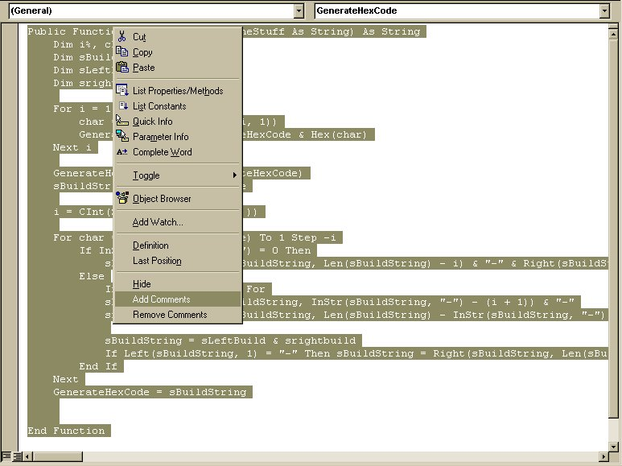



## Bulk Comment

### Description

Have you ever needed to comment out large blocks of code for testing/debugging, new versions, etc., then you might like this VB6 Add-In. It adds comment characters to the beginning of each "selected" line in a code pane. Just select the lines you want to comment out and right click for the pop-up menu (see screen shot).
 
### More Info
 
This assumes you know how to build and test VB Add-Ins.

One thing to watch out for is that it will uncomment a commented line, if the comment character is in the first column of a line.

             |
---                |---
**Submitted On**   |2002-11-02 03:19:10
**By**             |[Kurt J\. Tischer](https://github.com/Planet-Source-Code/PSCIndex/blob/master/ByAuthor/kurt-j-tischer.md)
**Level**          |Intermediate
**User Rating**    |4.3 (17 globes from 4 users)
**Compatibility**  |VB 6\.0
**Category**       |[VB function enhancement](https://github.com/Planet-Source-Code/PSCIndex/blob/master/ByCategory/vb-function-enhancement__1-25.md)
**World**          |[Visual Basic](https://github.com/Planet-Source-Code/PSCIndex/blob/master/ByWorld/visual-basic.md)
**Archive File**   |[Bulk\_Comme1490721122002\.zip](https://github.com/Planet-Source-Code/kurt-j-tischer-bulk-comment__1-40343/archive/master.zip)

